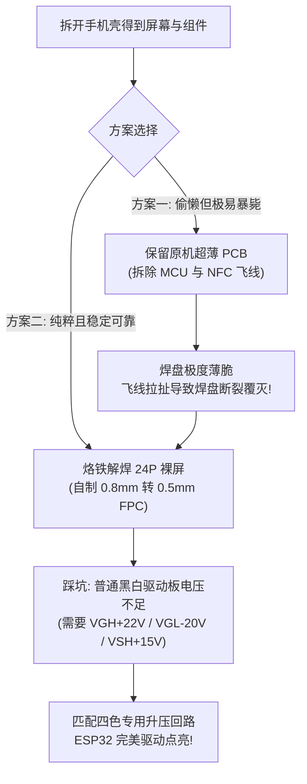

### 💡 捡漏前言：从 2.5 元盒马价签，到 25 元华为四色视网膜墨水屏

还记得几个月前那篇硬核暴改淘汰价签的记录吗？在[《极客硬核折腾：低成本捡漏改造盒马 2.13 英寸墨水屏价签》]()中，我们用 2.5 元买到了微雪标价 50 元的 2.13 英寸黑白墨水屏。

原以为那已经是电子垃圾捡漏界的极限了，万万没想到，最近闲鱼等平台上又掀起了一场更加疯狂的清仓风暴——**华为生态的智能四色墨水屏手机壳**（Porink Pixel / ReinkCase）大甩卖！

这种带无源 NFC 传图、背壳自带大面积电子纸视窗的智能手机壳，刚发布时的官方指导价普遍高达 **300 多元**。然而伴随着手机型号更新迭代与渠道清库存，如今**只要 25 元就能包邮到手**！


*图：到手的 Porink Pixel 华为彩显屏手机壳外包装，正面赫然标着“DESIGN FOR HUAWEI”与四色高清墨水屏*

这是什么概念？
* 之前是 **2.5 元买微雪 50 元** 的黑白小屏；
* 现在是 **25 元买微雪 220 元+** 的正宗 **3.98 英寸、768 × 552 超高分辨率、黑白黄红（BWRY）四色彩色墨水屏**！

看到这个价格，主播二话不说直接一口气拍了两个回来折腾。

然而，捡漏的乐趣永远伴随着折腾的代价。全网虽然零星有极客发过点亮视频，但**绝大多数项目要么藏着掖着不提供源码，要么对核心的驱动逻辑、引脚定义与底层硬件参数三缄其口**。

既然如此，那就由我来彻底填平这个坑！今天我把整套**无损拆解技巧、原板飞线踩坑与焊盘自毁教训、自制 0.8mm 转 0.5mm 45° 仿形 FPC 转接板工程、四色高压驱动回路陷阱，以及全网首发的 ESP32 MicroPython 完整驱动库和取模工具**毫无保留地分享出来。

---

### 🔬 效果先睹为快：ESP32-C3 成功点亮 3.98 寸四色墨水屏

经过数个日夜的逆向与调试，这块 3.98 寸四色屏幕终于在 ESP32-C3 上完美刷新：


*图：ESP32-C3 驱动 SE0398NZ07 (A0) 运行 Demo——左侧展示系统总线与四色色阶色块，右侧完美渲染 280×280 四色落日兽设头像点阵*

可以看到，无论是大字号的状态卡片、黑白黄红四种颜色的纯度，还是利用 Floyd-Steinberg 误差扩散算法量化的插画细节，层次感与细腻程度均远超传统低分辨率三色屏！

---

### 🛠️ 拆解实操：告别电磨笔，20秒无损开盖

比起之前盒马价签那种四周全超声波热压死焊、逼得人上电磨笔和超薄锯条的“牢笼级密封”，这款手机壳的拆解难度可谓降维打击。

手机壳背面是一整块微砂防爆玻璃后盖，千万不要直接拿蛮力撬，否则玻璃瞬间粉身碎骨。正确姿势如下：

1. **拆除镜头框**：先将摄像头区域凸起的金属装饰框扣下；
2. **热风枪软化背胶**：将热风枪温度设定为 **180℃**，风嘴对准手机壳四周边缘缝隙，以均速环形走位连续加热约 **20 秒**；
3. **滴入异丙醇 (IPA)**：在缝隙边缘适量滴入几滴高浓度异丙醇（或医用酒精），借助毛细现象迅速分解双面胶粘性；
4. **划片开盖**：拿出一片薄塑料翘片，从镜头镂空开孔的最薄弱一角轻轻插入，顺着边缘顺滑划拉一圈，“啪嗒”一声，整块玻璃后盖便完整脱落下来！

屏幕和主板完好无损，整个过程不过一两分钟。

---

### ⚡ 双方案对决：原板飞线的陷阱 vs 自制 FPC 绝地反击

打开后盖后，怎么把它接入我们的单片机（ESP32 / 树莓派 Pico / STM32）？目前市面上有两种技术路径：



#### 方案一：保留原机 PCB 飞线（看似省事，实则深坑）

这是网上很多所谓“免驱动板教程”最喜欢推荐的方案。

* **原理**：手机壳内置的狭长 PCB（丝印 `JY_DC24_NFC_V1.0 / ReinkCase`）本身就包含一套专用的墨水屏升压与驱动回路，所以不需要单独购买或制作驱动板。
* **操作步骤**：
  1. 拆除原板主控 MCU：主控芯片周围打了一圈硬质黑胶，必须先拿电烙铁调高温度烫软，再拿尖头雕刻刀小心将黑胶剃除，最后拿热风枪吹下芯片；
  2. 拔掉 NFC 天线：拆除主控后无源 NFC 失去意义，顺手拔掉天线 FPC 插座；
  3. 引出 8 根标准微雪 SPI 飞线：在 PCB 裸露的测试点上引出 `3V3`、`GND`、`DIN` (MOSI)、`CLK` (SCK)、`DC`、`CS`、`RST`、`BU` (BUSY)。


*图：手机壳原装 PCB 拆解图解——红叉位置为需拆除的主控 MCU 与 NFC 插座，红点标示出核心 8 根飞线测试焊盘*

> [!CAUTION]
> **主播的血泪教训**：  
> 这块 PCB 为了塞进手机壳，做得**极其薄**，表面铜箔与基板的粘合强度极低！主播在用杜邦线飞线时，稍微碰折了一下线缆，测试点的微型焊盘当场被生生连根扯断！整块板子瞬间报废。  
> 强烈劝告手残党或追求设备长期稳定性的朋友：**放弃飞线方案，走方案二！**

---

#### 方案二：解焊裸屏 + 自制转接 FPC + 专用驱动板（终极正解）

把裸屏从坏掉的原板上彻底拆下来：屏幕排线为标准的 **24-Pin、0.8mm 间距焊接式金手指**，涂上松香或焊油，用刀头烙铁轻轻一拖就能完整取下裸屏。

然而，真正的问题来了：**市面上所有通用的墨水屏驱动板，排线插座清一色都是 0.5mm 间距的翻盖 ZIF 插座！0.8mm 间距的屏根本插不进去！**

为了解决这个物理硬伤，主播专门使用 KiCad 设计了一块 **24-Pin 0.8mm 焊接端 转 0.5mm 金手指插拔端的 45° 仿形转接 FPC 排线**：


*图：主播精心设计的 45° 仿形转接 FPC 排线（嘉立创双面板 0 元券完美支持）*

##### FPC 设计精妙之处：
1. **45° 仿形平滑收拢**：切除一切冗余多余基材，顺应 0.8mm 到 0.5mm 的走线过渡；
2. **插舌与金手指精密公差**：插舌宽度精准控制在 **12.50 mm**，前端带 **0.3 mm × 45° 导向倒角**；金手指长度加长至 **3.20 mm**，采用无开窗桥的整排开窗工艺，杜绝 0.2mm 窄间隙覆盖膜起翘毛刺；
3. **双面补强精准定位**：插舌背面贴 `12.50 × 3.50 mm` PI 补强片（板厚达 0.3mm 完美卡紧 0.5mm 翻盖座），焊接端背面贴耐高温 PI 补强片；
4. **完全兼容嘉立创 0 元券**：严格遵循双面 FPC 工艺规范，在嘉立创下单直接享受每月双面 FPC 免单！设计工程与 Gerber 文件已全部收录在开源压缩包中。

---

### ⚠️ 避坑深水区：为什么普通的墨水屏驱动板点不亮？

搞定了 FPC 转接排线，是不是随便买一块十几块钱的通用 24P 墨水屏驱动板就能点亮了？

**答案是：绝对不行！主播在这里踩了巨大的坑。**

* 常见的市售微雪驱动板，绝大多数是针对 2.13 寸、2.9 寸**单色/双色/小三色**墨水屏设计的，其板载升压回路的电感量、二极管耐压和 MOS 管功率都非常小，输出电压一般在 +15V / -15V 以内。
* 然而，**这款 3.98 寸四色屏幕采用高密度 BWRY 彩色电泳微胶囊，其翻转电场需要极高的物理驱动电压**：
  * **VGH (正偏压)**：需稳定提供高达 **+22V**；
  * **VGL (负偏压)**：需稳定提供高达 **-20V**；
  * **VSH1 / VSH2 (驱动正高压)**：需提供 **+15V**。

如果你用普通黑白屏驱动板，芯片一开始跑升压指令（Power On 0x04），由于外部储能回路无法拉升到指定的高压阈值，BUSY 引脚就会永久处于低电平死锁，或者在刷色时因为电压不足导致大面积拖尾、缺色、淡色！

#### 推荐驱动板方案：
推荐配合立创开源硬件平台（OSHWHub）上的成熟开源项目：  
[墨水屏 FPC 转接板 (OSHWHub)](https://oshwhub.com/flamj0/mo-shui-ping-fpc-zhuan-jie-ban){: .preview }

直接找嘉立创打样 PCB，按 BOM 采购元器件（重点选用高耐压肖特基二极管与足额功率电感），在加热台上 **210℃ 回流焊** 焊接完成。插上转接排线，硬件驱动回路瞬间满血复活！

---

### 🧠 逆向攻坚：A0 / A1 物理栅极交错扫描算法大揭秘

硬件连通之后，最折磨人的就是驱动软件。这块屏幕的型号是 **`SE0398NZ07-FNG-A0`**（或 A1 批次）。参考了 MakerWorld 上极客们的反汇编成果，我终于理清了它的底层逻辑。
[华为 3.98 寸墨水屏支持 A0/A1 固件](https://makerworld.com.cn/zh/models/2694038-hua-wei-3-98cun-mo-shui-ping-zhi-chi-a0-a1gu-jian?from=search#profileId-3119240){: .preview }

#### 为什么常规 EPD 驱动传图会彻底花屏？
* 控制器内部 RAM 分辨率是 **768 × 600**，但物理可视区域仅为 **768 × 552**；
* 更加奇葩的是：**物理面板的行引脚并不是从 0 到 551 顺序排列的，而是由左右两侧的 Gate Driver 进行交错式物理寻址！**

必须逐行通过命令 `0x83`（Set Partial RAM Area）重设当前扫描窗口，再通过命令 `0x10`（Write RAM Data）写入 192 字节（768 像素）。

经过逆向提取，A0 与 A1 面板的物理交错寻址映射公式如下：

```python
# A0 与 A1 内部栅极物理交错地址映射:
if is_a1:
    y = (s2 * 2) - 599 if s2 <= 299 else (s2 * 2)
else: # A0 面板
    y = (s2 * 2) if s2 <= 275 else (1103 - 2 * s2)

# 将 y 填入 0x83 扫描区域指令的高低字节并下发
area[4] = y >> 8
area[5] = y & 0xFF
area[6] = y >> 8
area[7] = y & 0xFF
```

如果不按这个映射矩阵下发数据，你的图片就会被切成一条条奇偶错位、上下对穿的混沌条纹！

#### 针对 MicroPython 的极致性能优化：
1. **Viper 原生机器码加速 (23ms 位序转换)**：  
   MicroPython 的 `framebuf.GS2_HMSB` 格式在底层与 EPD 控制器的 SPI 传输位序存在差异。我利用 `@micropython.viper` 原生 JIT 装饰器编写了快速查找表变换，**103.5 KB 显存的全局位序重排仅耗时 23 毫秒**，毫无卡顿感。
2. **零内存流式图片加载 (`blit_raw_2bpp`)**：  
   在资源极其有限的 ESP32-C3 上，再开辟一份 100KB 的数组来解码图片很容易导致内存碎片或 OOM。驱动支持直接按行流式从 Flash 中读取 `.raw` 点阵文件写入显存，内存开销降为 0！

---

### 📦 全套开源资源与高速下载

为了让各位极客不再重复踩坑，我将本次涉及的**全套 MicroPython 驱动源码、大字号与画线 Demo、四色落日头像点阵包、PC 端 Python 图片量化转换脚本，以及 KiCad/立创 EDA 转接排线工程文件**完整打包上传：



#### 压缩包内部结构：
```text
SE0398NZ07_MicroPython/
├── epd3in98.py                      # ★ 核心驱动库 (支持 A0/A1、Viper 加速、大字号与流式加载)
├── demo.py                          # ★ 演示应用程序 (状态栏、参数仪表盘与四色插画展示)
├── avatar.raw                       # 280x280 4色落日头像点阵资源文件 (19.6 KB)
├── convert_image.py                 # PC 端图片转码工具 (Floyd-Steinberg 误差扩散与调色板量化)
├── README.md                        # 快速上手与引脚配置说明
└── fpc/                             # ★ 0.8mm 转 0.5mm 45° 仿形转接排线硬件工程
    ├── 0.8_0.5_fpc_45degree_KiCad/  # KiCad PCB 版图源码
    ├── 0.8_0.5_fpc_45degree.epro    # 嘉立创 EDA 专业版工程
    ├── README.md                    # FPC 规格书与嘉立创 0 元打样指南
    └── standard_24pin.py            # 引脚网络与标准 24-Pin 比对校验脚本
```

---

### 🚀 快速上手示例 (ESP32-C3)

在 ESP32-C3 上刷入标准 MicroPython 固件后，通过 Thonny 或 `mpremote` 上传 `epd3in98.py`、`demo.py` 和 `avatar.raw`，运行即可点亮：

```python
from machine import Pin, SPI
from epd3in98 import EPD_3in98, BLACK, WHITE, YELLOW, RED

# 1. 初始化硬件 SPI 与控制引脚
spi = SPI(1, baudrate=8000000, polarity=0, phase=0, sck=Pin(4), mosi=Pin(6))
cs   = Pin(7, Pin.OUT, value=1)
dc   = Pin(1, Pin.OUT, value=0)
rst  = Pin(2, Pin.OUT, value=1)
busy = Pin(10, Pin.IN)

# 2. 实例化驱动 (根据屏幕背标选择 'A0' 或 'A1')
epd = EPD_3in98(spi, cs, dc, rst, busy, panel_version='A0')

# 3. 基础绘图与文本绘制
epd.fill(WHITE)
epd.fill_rect(20, 20, 320, 80, BLACK)
epd.draw_text("HELLO WORLD", 40, 45, WHITE, scale=3, bold=True)

# 4. 零内存流式载入 4 色点阵图片
epd.blit_raw_2bpp("avatar.raw", 460, 180, 280, 280)

# 5. 触发物理全刷并进入超低功耗休眠
epd.display()
epd.sleep()
```

如果你有自己的照片想显示，直接在电脑端执行：
```bash
python convert_image.py your_avatar.png avatar.raw 280 280
```
脚本会自动生成带有误差扩散算法的 4 色预览图，并将打包好的 `.raw` 文件输出到同级目录，一键传输至单片机即可显示！

---

### 🏁 总结与致谢

从 2.5 元的黑白小价签，到 25 元的 3.98 寸视网膜四色屏，这就是属于开源硬件与垃圾佬玩家独有的乐趣。原厂 300 多元的高端手机配件在退役后，通过一块小小的自制 FPC 转接排线和几十行优化驱动代码，重新化身为桌面上极其精美的智能温湿度时钟、桌面便签或者随身艺术画框。

感谢开源社区先驱者们在逆向工程中的无私探索，也希望这份完整的软硬件方案能帮助大家少走弯路。祝各位极客朋友们都能顺利点亮属于自己的四色彩色墨水屏！
